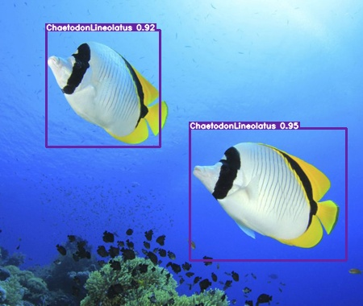
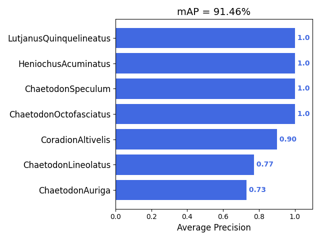

# iKnowFish

Fish Detection by YOLO



*mean Average Precision



* to do  
<a href="https://colab.research.google.com/drive/1SZ3dFU82RAPcaYybyFkaJ2YLaKDoq2Yf"></a>

## Quick Start


## Running the code

### train

### mAP

convert ground truth PASCAL VOC xml to the specified format
```
python ./mAP/scripts/extra/convert_gt_xml.py
```
convert detection result yolo format to the specified format
```
python ./mAP/scripts/extra/convert_dr_yolo.py
```
run main.py to calculate mAP
```
python ./mAP/main.py
```

## Acknowledgements

* [taipingeric/yolo-v4-tf.keras](https://github.com/taipingeric/yolo-v4-tf.keras)  
* [Cartucho/mAP](https://github.com/Cartucho/mAP)
